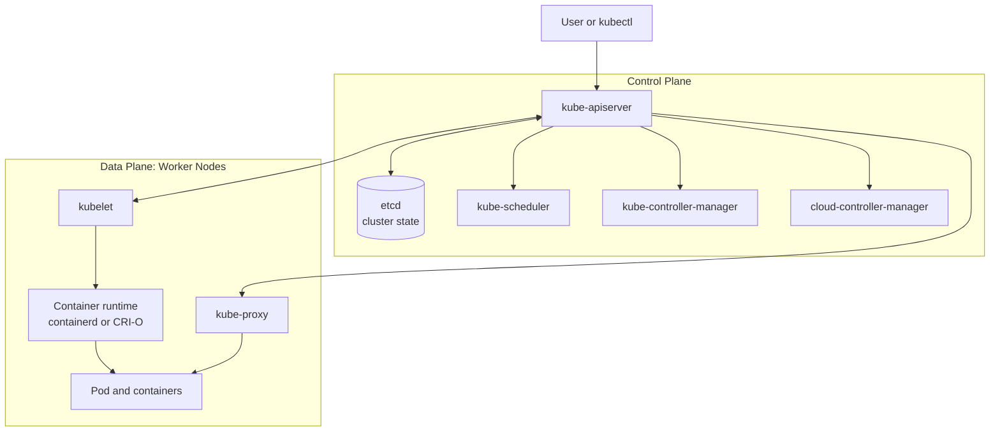
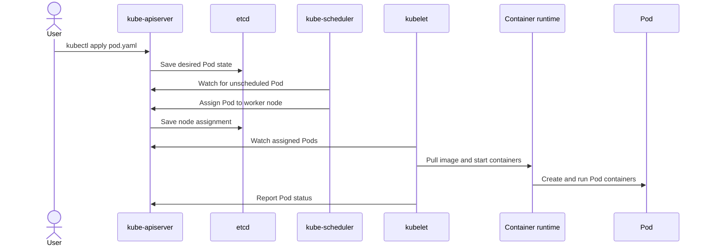

# Kubernetes Architecture

Kubernetes is a cluster of **control plane nodes** and **worker nodes**. In production, multiple nodes of either type can be used for high availability and capacity.

## High-Level Architecture

## Control Plane Components

| Component | Purpose |
| --- | --- |
| **kube-apiserver** | The entry point for Kubernetes. It authenticates and validates requests, exposes the Kubernetes API, and coordinates communication between components. |
| **etcd** | A consistent key-value store containing the desired and current state of the cluster. It is not merely a backup; losing it means losing the cluster's stored state. |
| **kube-scheduler** | Selects a suitable worker node for each newly created Pod by considering resources, constraints, affinity, taints, and tolerations. |
| **kube-controller-manager** | Runs controllers that continuously compare actual state with desired state and make corrections, such as creating replacement Pods. |
| **cloud-controller-manager** | Connects Kubernetes with a cloud provider's APIs for resources such as nodes, load balancers, and cloud routes. It is used in cloud-based clusters. |

## Worker Node Components

| Component | Purpose |
| --- | --- |
| **kubelet** | The node agent. It watches the API server for Pods assigned to its node, asks the runtime to create containers, and reports their status back. |
| **Container runtime** | Pulls images and creates, starts, and stops containers through the CRI. Common runtimes are **containerd** and **CRI-O**. |
| **kube-proxy** | Maintains node networking rules so traffic can reach the correct Pod behind a Kubernetes Service. Modern clusters may use an alternative dataplane instead of kube-proxy. |

The worker components can run a container, but the control plane is needed to provide the cluster's API, scheduling, state storage, and reconciliation. It turns individual machines into one managed cluster.

## Pod Creation Example

When a user runs `kubectl apply -f pod.yaml`:

1. `kubectl` sends the Pod manifest to the **kube-apiserver**.
2. The API server authenticates and validates the request, then stores the desired Pod state in **etcd**.
3. The **scheduler** notices that the Pod has no node and selects a suitable worker node.
4. The scheduler records the selected node through the API server, and the assignment is stored in etcd.
5. The **kubelet** on that worker watches the API server, sees the assigned Pod, and asks the container runtime to pull the image and start the containers.
6. The kubelet continuously checks the containers and reports Pod status to the API server.
7. If the Pod is exposed through a Service, **kube-proxy** updates networking rules so traffic can reach the Pod.

## Dockershim

Kubernetes once included **Dockershim**, a temporary translation layer that allowed Kubernetes to use Docker before Docker supported the CRI. Dockershim was removed from Kubernetes. Current clusters normally communicate directly with a CRI-compatible runtime such as **containerd** or **CRI-O**; Docker may still be used to build images.
