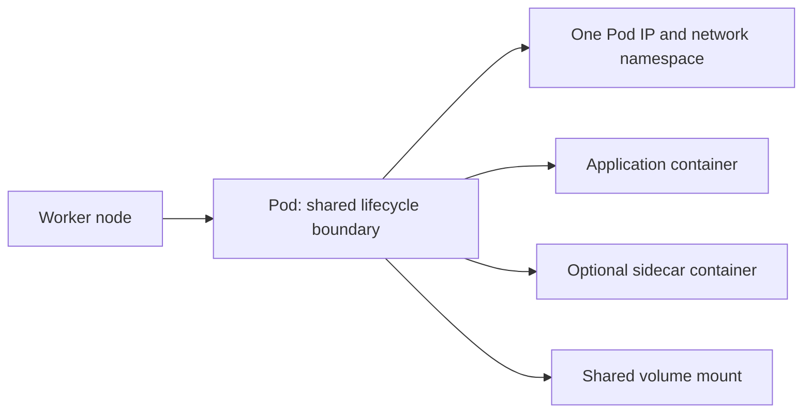
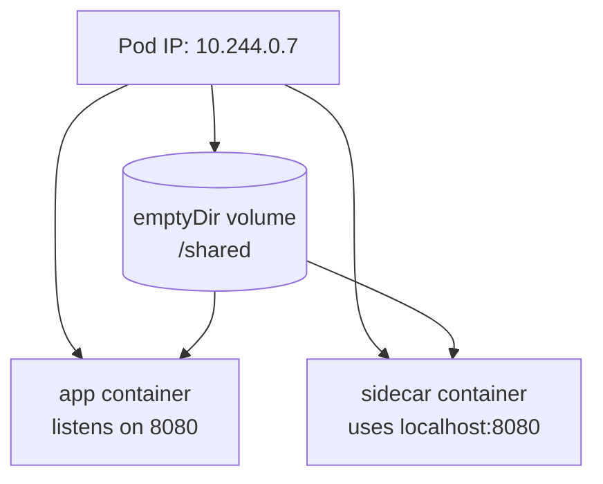
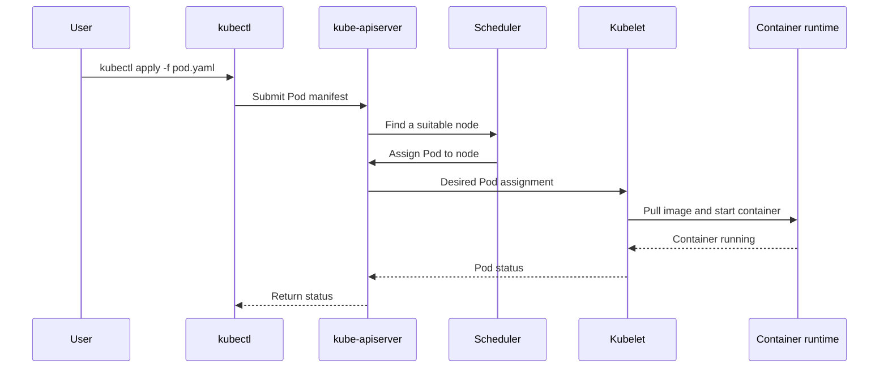

# Kubernetes Pods: Brief Practical Notes

## What is a Pod?

A **Pod** is the smallest deployable unit in Kubernetes. It is a wrapper around one or more closely related containers.

Most Pods contain one container. Multiple containers belong in the same Pod only when they must share the same network namespace and/or closely coupled storage. Kubernetes schedules and replaces the Pod as one unit; it does not normally manage an individual container directly.



### Pod versus container

| Container | Pod |
| --- | --- |
| Runs one application process from an image | Kubernetes unit that groups one or more containers |
| Has its own filesystem layer and process space | Provides shared networking, storage mounts, and lifecycle boundary |
| Can run with Docker or another runtime | Is scheduled by Kubernetes onto a node |
| Communicates with other containers through a network | Containers in one Pod can use `localhost` to communicate |

The Pod is not a virtual machine. Containers in the same Pod run on the same node and share the Pod's network namespace.

## A Basic Pod Manifest

Save this as `pod.yaml`:

```yaml
apiVersion: v1
kind: Pod
metadata:
	name: nginx
	labels:
		app: nginx
spec:
	containers:
		- name: nginx
			image: nginx:1.27
			ports:
				- containerPort: 80
```

Important fields:

- `apiVersion`: API version for this resource.
- `kind`: Resource type, here `Pod`.
- `metadata.name`: Name used by commands such as `kubectl get pod nginx`.
- `spec.containers`: Containers that Kubernetes should run.
- `image`: Container image and tag.
- `containerPort`: Documents the port the application listens on; it does not expose the Pod outside the cluster by itself.

For a real application, a `Deployment` is usually preferred because a bare Pod is not recreated when it is deleted. Deployments are covered later.

## Two Containers in One Pod

Containers in one Pod share:

1. **Network:** one IP address and one network namespace. If the main container listens on port `8080`, a sidecar can call it at `http://localhost:8080`.
2. **Storage:** a volume can be mounted into both containers. The volume provides the shared directory; containers do not automatically share their private filesystem layers.



Example:

```yaml
apiVersion: v1
kind: Pod
metadata:
	name: app-with-sidecar
spec:
	volumes:
		- name: shared-data
			emptyDir: {}
	containers:
		- name: app
			image: nginx:1.27
			volumeMounts:
				- name: shared-data
					mountPath: /usr/share/nginx/html
		- name: sidecar
			image: busybox:1.36
			command: ["sh", "-c"]
			args: ["while true; do date > /shared/index.html; sleep 10; done"]
			volumeMounts:
				- name: shared-data
					mountPath: /shared
```

`emptyDir` lasts for the lifetime of the Pod. It is useful for temporary sharing, not durable data. Persistent data needs a PersistentVolume or an external data store.

## What is `kubectl`?

`kubectl` is the command-line client for the Kubernetes API. It reads the cluster address and credentials from the kubeconfig file, usually `~/.kube/config`, sends an HTTPS request to the API server, and prints the response.



Common daily commands:

```bash
# Cluster and node information
kubectl cluster-info
kubectl get nodes
kubectl get nodes -o wide

# Pods and more detail
kubectl get pods
kubectl get pods -o wide
kubectl get pods -A                 # all namespaces
kubectl describe pod nginx
kubectl logs nginx
kubectl logs -f nginx               # follow logs
kubectl exec -it nginx -- sh        # open a shell in a container

# Create, update, validate, and remove resources
kubectl apply -f pod.yaml
kubectl diff -f pod.yaml
kubectl get pod nginx -o yaml
kubectl delete -f pod.yaml
kubectl delete pod nginx

# Namespaces and labels
kubectl get namespaces
kubectl get pods --show-labels
kubectl get pods -l app=nginx
```

`kubectl create -f pod.yaml` also creates a resource, but `kubectl apply -f pod.yaml` is usually preferred because it can create or update the declared configuration.

## Install and Start Minikube

Install `kubectl` and Minikube using the official installation instructions for your operating system. On Windows, Minikube commonly uses the Docker driver or Hyper-V driver.

```powershell
minikube start --memory=4096 --driver=docker
```

Command breakdown:

- `minikube start`: creates or starts a local Kubernetes cluster.
- `--memory=4096`: gives the Minikube VM or container environment about 4096 MB of memory.
- `--driver=docker`: runs Minikube using Docker. Use a driver installed on your machine.

The default `minikube start` chooses a suitable default driver and resource size. Explicit options make the setup repeatable. The original command `--mermory=4096 --driver=hyperkit` has a spelling error (`memory`) and `hyperkit` is primarily a macOS driver, so it is not the right default for Windows.

Check the cluster:

```powershell
minikube status
kubectl get nodes
kubectl get pods -A
```

Expected output from `kubectl get nodes` should show one node with status `Ready`.

## Create and Test the Nginx Pod

Create the file from the manifest above, then run:

```powershell
kubectl apply -f pod.yaml
kubectl get pods
kubectl get pods -o wide
```

The `-o wide` output shows the Pod IP and the node where it is running. Pod IPs are internal and can change, so do not use one as a permanent application address.

Inspect or test the Pod:

```powershell
kubectl describe pod nginx
kubectl logs nginx
kubectl exec nginx -- nginx -t
kubectl exec -it nginx -- sh
```

From a Minikube node shell, the Pod IP can be tested when the image contains the required tool:

```powershell
minikube ssh
curl http://<POD-IP>:80
exit
```

Use the actual IP from `kubectl get pods -o wide`; do not copy an example such as `172.17.0.3`, because Pod IP ranges depend on the cluster network. A more portable command is:

```powershell
kubectl port-forward pod/nginx 8080:80
```

Then open `http://localhost:8080` in a browser or run `curl http://localhost:8080` in another terminal.

Delete the Pod when finished:

```powershell
kubectl delete pod nginx
# or, when it was created from the manifest:
kubectl delete -f pod.yaml
```

## Kubernetes `kubectl` Cheatsheet

Use the official reference for commands not covered here:

- [Kubectl command reference](https://kubernetes.io/docs/reference/kubectl/)
- [Kubectl cheatsheet](https://kubernetes.io/docs/reference/kubectl/cheatsheet/)

## Scope

This note covers the basic Pod concept, shared networking and storage, `kubectl`, Minikube, and a first practical exercise. It intentionally does not cover Deployments, Services, auto-scaling, auto-healing, probes, or production architecture. Those advanced topics will be covered separately.

