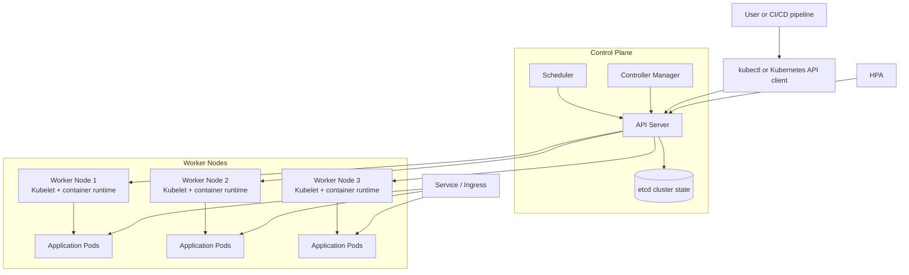
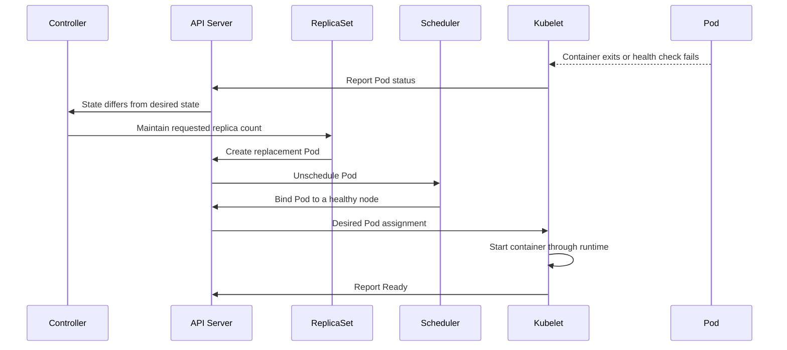

# Introduction to Kubernetes

## What is Kubernetes?

Kubernetes (also called **K8s**) is an open-source platform for deploying, managing, scaling, and updating containerized applications. It is a **container orchestration platform**: instead of managing individual containers manually, we describe the desired state of an application and Kubernetes works continuously to maintain that state.

Kubernetes can run containers using container runtimes such as `containerd` or CRI-O. Docker is commonly used to build and distribute container images, but Docker and Kubernetes solve different problems:

| Tool | Primary responsibility |
| --- | --- |
| Docker | Build images and run individual containers |
| Kubernetes | Schedule and operate containers across a cluster |

## Why Do We Need Kubernetes?

A single Docker host is useful for development and small deployments, but operating many containers in production introduces several challenges:

- **Failure recovery:** A crashed process or failed host can make an application unavailable.
- **Scheduling:** Containers must be placed on machines with enough CPU and memory.
- **Scaling:** The number of application instances must increase or decrease with demand.
- **Networking:** Users need a stable endpoint even when containers are replaced.
- **Updates:** New application versions should be deployed without unnecessary downtime.
- **Service discovery:** Applications need a reliable way to find one another.
- **Configuration and secrets:** Environment-specific settings should be managed separately from images.
- **Observability:** Operators need health checks, logs, and metrics to understand the system.

Kubernetes provides primitives for these tasks. It does not automatically replace every enterprise tool: firewalls, API gateways, monitoring systems, and cloud load balancers may still be used alongside it.

## Important Kubernetes Terms

### Cluster

A **cluster** is a group of machines managed by Kubernetes. The machines are called **nodes**.

### Control plane

The **control plane** makes cluster-wide decisions and stores the desired state. Its main components are:

- **API server:** The entry point for `kubectl`, users, and automation.
- **etcd:** A consistent key-value store containing Kubernetes state.
- **Scheduler:** Selects a suitable node for each new Pod.
- **Controller manager:** Runs controllers that compare the desired state with the actual state and take corrective action.

In older documentation, these machines were often called **master nodes**. **Control plane** is the preferred term.

### Worker node

A **worker node** runs application workloads. It normally contains:

- **Kubelet:** Ensures that the Pods assigned to the node are running.
- **Container runtime:** Starts and stops containers.
- **Kube-proxy or an equivalent networking component:** Helps implement Service networking.

### Pod

A **Pod** is the smallest deployable unit in Kubernetes. It contains one or more closely related containers that share networking and storage. Containers are normally managed through Pods, not created directly by an operator.

### Deployment and ReplicaSet

A **Deployment** describes how an application should be rolled out and rolled back. It usually manages a **ReplicaSet**, which ensures that the requested number of identical Pod replicas exists.

### Service

A **Service** provides a stable virtual IP and DNS name for a group of Pods selected by labels. Because Pods are replaceable, clients should connect to a Service rather than to a Pod IP.

### Horizontal Pod Autoscaler

The **Horizontal Pod Autoscaler (HPA)** changes the number of Pod replicas according to metrics such as CPU utilization, memory usage, or application metrics. It is one part of scaling; the cluster may also need a node autoscaler to add more worker nodes when capacity is exhausted.

## Kubernetes Architecture

The following simplified architecture shows the relationship between users, the control plane, worker nodes, and the workloads running in Pods:



## How Kubernetes Auto-Healing Works

Auto-healing is the process of bringing the actual cluster back to the desired state. For example, a Deployment may declare that three replicas of an application must always be running.

1. The controller reads the desired state from the API server and observes the actual state through the Kubernetes API.
2. A liveness probe may report that a container is unhealthy. The kubelet restarts that container.
3. If a Pod terminates, the ReplicaSet notices that fewer than three replicas exist and creates a replacement Pod.
4. The scheduler selects a suitable worker node for the replacement Pod.
5. The kubelet on that node asks the container runtime to start the required container.
6. The Service continues directing traffic to healthy Pods. The failed Pod is removed from the Service endpoints until its readiness probe succeeds.
7. If an entire node fails, the control plane detects the failure and reschedules eligible Pods on healthy nodes. Persistent data requires suitable storage and is not recovered merely by restarting a Pod.

This is reconciliation: Kubernetes repeatedly compares the desired state with the observed state and performs actions until they match.



### Health probes

- **Liveness probe:** Determines whether a container should be restarted.
- **Readiness probe:** Determines whether a Pod can receive traffic.
- **Startup probe:** Gives a slow-starting application time to initialize before liveness checks begin.

Auto-healing is not a substitute for application design. An application should be stateless where possible, handle graceful shutdown, and store durable data in persistent storage or an external data service.

## Why Kubernetes Is Suitable for Enterprise Environments

Kubernetes is useful at enterprise scale because it provides a common operational model for many applications and environments:

- **High availability:** Workloads can run as multiple replicas across nodes and availability zones.
- **Declarative operations:** Configuration is stored as manifests or chart values, making deployments repeatable and reviewable.
- **Self-healing:** Failed containers and Pods are restarted or replaced automatically.
- **Elastic scaling:** HPA scales Pods, while cluster autoscaling can add or remove nodes.
- **Traffic management:** Services, Ingress, and Gateway APIs provide stable routing and external access.
- **Safe releases:** Deployments support rolling updates and rollbacks; canary and blue-green strategies can be added with suitable tooling.
- **Resource governance:** Requests, limits, namespaces, quotas, and policies help teams share infrastructure responsibly.
- **Security controls:** RBAC, service accounts, network policies, secret management, and admission policies support layered security.
- **Portability:** The same Kubernetes concepts can be used on public cloud, private cloud, or on-premises infrastructure, subject to provider differences.
- **Extensibility:** Operators, custom resources, and a large ecosystem allow teams to integrate databases, observability, security, and delivery tools.

## A Practical Request Flow

When a user accesses an application, a typical request path is:

```text
Client -> Load balancer -> Ingress or Gateway -> Service -> Ready Pod -> Container
```

When an operator deploys a new version:

```text
Manifest or Helm chart -> API server -> Deployment -> ReplicaSet -> Pods -> Service endpoints
```

## Key Takeaways

- Docker packages and runs containers; Kubernetes orchestrates containerized workloads across a cluster.
- A Kubernetes cluster consists of a control plane and worker nodes.
- Pods are replaceable, so Services provide stable access to applications.
- Deployments and ReplicaSets maintain the required number of application replicas.
- Controllers, kubelets, probes, and the scheduler work together to provide auto-healing.
- HPA scales Pod replicas based on demand, while node autoscaling provides additional machine capacity.
- Kubernetes improves enterprise operations, but it works together with external systems such as cloud load balancers, firewalls, registries, monitoring, and API gateways.
